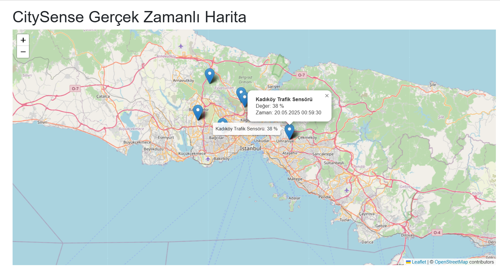

# CitySense: Real-Time Urban Data Visualization and Anomaly Detection Platform (In Development)

**CitySense** is a platform aimed at collecting various sensor data from a city to visualize it in real-time on a map, detect anomalous situations, and notify relevant users. This project integrates modern .NET technologies with Geographic Information System (GIS) capabilities.

**Project Status:** Currently in development. The foundational infrastructure, data generation большинство, API data presentation, and static data display on the map have been completed. Real-time data streaming integration with SignalR is ongoing.

---

## 🛰️ What is CitySense? (Hedeflenen / Targeted)

🇹🇷 CitySense, bir şehrin çeşitli metriklerini (hava durumu, trafik yoğunluğu, gürültü seviyesi, park doluluk oranı vb.) sensörler aracılığıyla toplayarak aşağıdaki işlevleri sunmayı hedefler:
*   **Gerçek Zamanlı Görselleştirme:** Toplanan verilerin interaktif bir harita üzerinde anlık olarak sunulması.
*   **Anomali Tespiti:** Veri akışındaki normal dışı durumların (örn: ani trafik sıkışıklığı, aşırı gürültü artışı) otomatik olarak belirlenmesi.
*   **Bildirim Sistemi:** Tespit edilen anomaliler veya önemli olaylar hakkında kullanıcılara (örn: şehir yöneticileri, vatandaşlar) anlık veya periyodik bildirimler gönderilmesi.

🇬🇧 CitySense aims to collect various urban metrics (e.g., weather conditions, traffic density, noise levels, parking availability) via sensors to provide the following functionalities:
*   **Real-Time Visualization:** Instantaneous presentation of collected data on an interactive map.
*   **Anomaly Detection:** Automatic identification of abnormal situations in the data stream (e.g., sudden traffic congestion, excessive noise increase).
*   **Notification System:** Sending real-time or periodic notifications to users (e.g., city administrators, citizens) about detected anomalies or significant events.

## 🚦 Real-World Application Areas (Potansiyel / Potential)

🇹🇷
*   Belediyeler ve kamu kurumları için şehir analitiği ve karar destek sistemleri.
*   Akıllı Şehir (Smart City) çözümlerine entegrasyon.
*   IoT (Nesnelerin İnterneti) ve sensör ağları ile veri toplama ve yönetimi.
*   Trafik yönetimi, çevre kirliliği izleme, acil durum yönetimi gibi alanlarda kullanılabilirlik.

🇬🇧
*   Urban analytics and decision support systems for municipalities and public institutions.
*   Integration with Smart City solutions.
*   Data collection and management with IoT (Internet of Things) and sensor networks.
*   Applicability in areas such as traffic management, environmental pollution monitoring, and emergency management.

## 🎯 Core Features Developed So Far

*   **Backend Infrastructure:**
    *   Layered architecture (API, Domain, Data, Shared) with ASP.NET Core Web API.
    *   PostgreSQL database with PostGIS extension for geographic data storage and basic querying capabilities.
    *   Entity Framework Core for database interaction.
    *   A shared library for Data Transfer Objects (DTOs).
*   **Simulated Data Generation:**
    *   A background service using `IHostedService` that periodically generates random sensor data (including location, sensor type, and measurement value) and saves it to the database.
*   **API Endpoint:**
    *   A `GET /api/sensordata/latest` endpoint serving recent sensor data in DTO format.
    *   CORS configuration.
*   **Frontend Infrastructure:**
    *   Blazor WebAssembly project.
    *   Integration of Leaflet mapping library (via `BlazorLeaflet-net6` or a similar Blazor wrapper).
    *   Display of static markers on the map using data fetched from the API.
*   **SignalR Foundation:**
    *   SignalR Hub (`SensorDataHub`) and data broadcasting mechanism implemented in the backend.
    *   SignalR client service (`SignalRService`) established in the frontend, with successful connection to the Hub.

## 🧱 Technologies Used (Current Stack)

*   **Backend:**
    *   ASP.NET Core 6.0 Web API
    *   Entity Framework Core 6.0
    *   SignalR (ASP.NET Core)
*   **Database:**
    *   PostgreSQL (running on Docker)
    *   PostGIS Extension (for geospatial data)
    *   NetTopologySuite (for geospatial types in .NET)
*   **Frontend:**
    *   Blazor WebAssembly (.NET 6.0)
    *   Leaflet.js (Map rendering)
    *   BlazorLeaflet-net6 (or a similar Blazor wrapper)
    *   Microsoft.AspNetCore.SignalR.Client
*   **Core & Others:**
    *   C#
    *   Dependency Injection (DI)
    *   RESTful API Principles
    *   JSON

## 🧠 Distinguishing Aspects of the Project (Targeted)

*   Beyond basic CRUD operations, focusing on real-time data processing and visualization.
*   Geospatial data analysis and map-based presentation.
*   Integration of diverse technologies (Backend, Frontend, Database, Real-Time Communication).
*   Potential to offer solutions for real-world urban challenges.

## 🔧 Current Status & Next Steps

**Successfully Implemented:**
*   The foundational project structure and layers are established.
*   The database schema (Sensors, SensorDataPoints) has been created using Entity Framework Core migrations.
*   The background service for simulated data generation is operational and regularly populates the database.
*   The API endpoint (`/api/sensordata/latest`) serves data via DTOs.
*   A basic map is rendered in the frontend, displaying initial data успішно as markers fetched from the API.
*   SignalR connection between backend and frontend is successfully established; the API broadcasts new data via SignalR.

**Currently Working On / Next Steps:**
1.  **Resolving SignalR Live Update Issue:** Ensuring the frontend receives messages via SignalR and updates map markers in real-time. (Current primary focus)
2.  **Anomaly Detection Module:**
    *   Detection of anomalous data points using simple thresholds or Z-score.
    *   Optional: Advanced anomaly detection using ML.NET.
3.  **Notification System:**
    *   Real-time SignalR notifications (in-app) for detected anomalies.
    *   Email notifications for critical events.
4.  **Enhanced Map Interactions:**
    *   Displaying detailed information or charts upon clicking markers.
    *   Implementing geospatial filtering on the map.
5.  **User Interface/Experience Improvements:** Creating a more user-friendly and informative interface.
6.  **Testing:** Implementing unit and integration tests.
7.  **(Optional) Further Development Ideas:** Admin dashboard, role-based access control, integration with real-world data APIs.

## 🚀 Setup and Running (Development Environment)

1.  **Prerequisites:**
    *   .NET 6.0 SDK
    *   Docker (for PostgreSQL + PostGIS container)
    *   Visual Studio 2022 (or a compatible IDE)
2.  **Database Setup:**
    *   Use the `docker-compose.yml` file in the project root to start the PostgreSQL + PostGIS container: `docker-compose up -d`
3.  **API Project Configuration:**
    *   Update the `ConnectionStrings.DefaultConnection` in `CitySense.Api/appsettings.json` according to your Docker PostgreSQL settings (username, password).
4.  **Running the Projects:**
    *   Open the solution in Visual Studio.
    *   Configure multiple startup projects: set both `CitySense.Api` and `CitySense.Frontend` to "Start".
    *   Start the projects (F5). The API and Frontend will run on different ports.

## 🙏 Contributing

This project is a personal development and learning endeavor. Ideas and suggestions are welcome.

---
